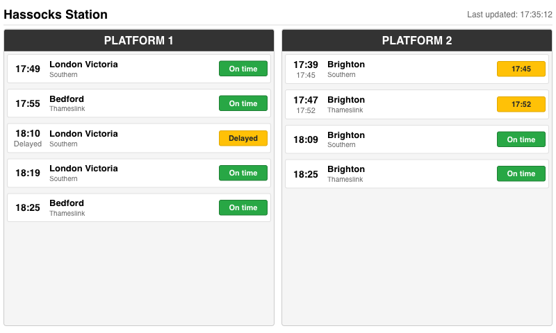

# Hassocks Station Departure Board

A Flask web application that displays real-time train departure information using the UK Rail Data API. This is lightly optimised for Hassocks (HSK) but can work for any UK railway station by changing the 3 letter station code in the API URL. 

As well as a realtime dashboard, an 800x480 image is generated when data is refreshed, this is intended for displaying on an e-paper display.



## Features

- **Live Data**: Fetches real-time train data from the UK Rail Data API
- **Platform Display**: Shows services grouped by Platform 1 and Platform 2
- **Status Indicators**: Color-coded status (On time, Delayed, Cancelled)
- **Auto-refresh**: Updates every 30 seconds
- **Responsive Design**: Optimized for 800x480 display, portrait or landscape

## Running Without Docker

### Prerequisites

- Python 3.9+
- Flask 2.3.3
- requests 2.31.0

### Setup

1. **Install dependencies**:
   ```bash
   pip install -r requirements.txt
   python -m playwright install
   ```

2. **Run the application**:
   ```bash
   python app.py
   ```

3. **Access the departure board**:
   Open your browser and navigate to `http://localhost:5001`

### Environment Variables (Optional)

You can override the default API credentials using environment variables:

```bash
export RAIL_API_KEY="your_api_key_here"
export RAIL_API_URL="your_api_url_here"
python app.py
```

## Running With Docker

### Building the Docker Image

```bash
docker build -t hassocks-departure-board .
```

### Running the Container

```bash
docker run -d -p 5001:5001 --name departure-board hassocks-departure-board
```

### Using Environment Variables (Optional)

If you need to override the default API credentials:

```bash
docker run -d -p 5001:5001 \
  -e RAIL_API_KEY="your_api_key_here" \
  -e RAIL_API_URL="your_api_url_here" \
  --name departure-board hassocks-departure-board
```

### Access the Application

Once running, open your browser and navigate to: http://localhost:5001

Fetch the latest dashboard screenshot: http://localhost:5001/image.png 

